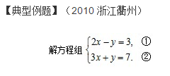
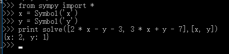
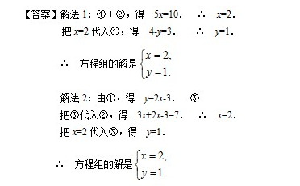
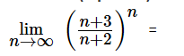
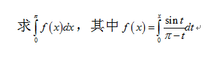

## 用python解方程

本文将介绍如何用python解决数学题。
说到数学题，相信大家都不陌生，从小学到大学都跟数学打交道。
其中初中的方程组，高中的二次曲线，大学的微积分最为头疼，今天我们将使用python
来解决方程组问题，微积分问题。

本文用到的相关知识：

- python基础
- python的Sympy库


### Sympy库介绍

SymPy是符号数学的Python库。它的目标是成为一个全功能的计算机代数系统，同时保持代码简洁、易于理解和扩展。
SymPy完全是用Python写的，并不需要外部的库。

大家可能还是不太明白，我稍微解释一下，单纯用语言内置的运算与变量解决的是，由值求结果。如：

```python
#仅用于说明，不要直接运行
print x + y
```

上式中的x与y在这条语句执行前你肯定得赋值的，否则就会出错。

而符号计算不同，你可以在之前将其设为符号。

```python
#仅用于说明，不要直接运行
x = Symbol('x')
y = Symbol('y')
print x + y
```

上述代码是可以的。因为Sympy库将x与y转换成了符号（概念上）。
经过介绍，你应该稍微懂了一点，经过下面的介绍，你会更加明白。


### 解二元一次方程功能实现

解方程的功能主要是使用Sympy中solve函数实现。

示例题目是：


#### 符号表示

方程中的符号

```python
from sympy import *
x = Symbol('x')
y = Symbol('y')
```

或者

```python
from sympy import *
x, y = symbols('x y')
```

第二个用空格隔开，下面代码中用x，y。括号里面的其实可以随意定义，因为是显示用。
比如：

```python
x = Symbol('x1')
```

但考虑到易读性还是相同比较好。

#### 方程表示

代码表示与手写还是有区别的，下面列出常用的：

- 加号 +
- 减号 -
- 除号 /
- 乘号 *
- 指数 **
- 对数 log()
- e的指数次幂 exp()

对于长的表达式，如果不确定，就加小括号

题目中表达式可表示为：

```python
2 * x - y - 3 
3 * x + y - 7
```

由于需要将表达式都转化成右端为0

#### 利用solve函数解方程

在解决例子之前，我们先解决一个一元一次的方程。

```python
x * 2 - 4
```

虽然很容易口算出来，我们还是要用solve函数

```python
print solve(x * 2 - 4, x)
#result
#[2]
```

solve：第一个参数为要解的方程，要求右端等于0，第二个参数为要解的未知数。还有一些
其他的参数，想了解的可以去看官方文档。

下面进行例题求解：

```python
solve([2 * x - y - 3, 3 * x + y - 7],[x, y])
```

完整代码为：

```python
from sympy import *
x = Symbol('x')
y = Symbol('y')
print solve([2 * x - y - 3, 3 * x + y - 7],[x, y])
```
结果如下：



麻麻，我跟正确答案一样哦~



### 解微积分相关习题实现

示例题目一（求极限）：



#### 符号表示及方程表示

```python
from sympy import *
n = Symbol('n')
s = ((n+3)/(n+2))**n
```

#### 利用limit函数求极限

在解之前通过几个例子认识一下limit函数

```python
from sympy import *
x = Symbol('x')
print limit(1/x**2, x, 0)
#result
#oo
print limit(x*(sqrt(x**2 + 1) - x), x, oo)
#result
#1/2
```

介绍一下结果中出现的符号：

- oo 无穷大
- E e 
- pi 圆周率 

另外可以使用init_printing()来使我们的输出更美观,也可直接用pprint()函数

比如

```python
>>> from sympy import *
>>> x = Symbol('x')
>>> x*(sqrt(x**2 + 1) - x)
  /        ________\
  |       /  2     |
x*\-x + \/  x  + 1 /
```

完整代码：

```python
from sympy import *
n = Symbol('n')
s = ((n+3)/(n+2))**n
print limit(s, n, oo)
#result
#E
```


示例题目二（求定积分）：



#### 符号表示

```python
from sympy import *
t = Symbol('t')
x = Symbol('x')
```

#### 方程表示与使用integrate函数求解

integrate函数用于积分问题 

例子：

```python
>>> integrate(6*x**5, x)
 6
x
>>> integrate(cos(x), x)
sin(x)
```

表示 f(x) ：

```python
m = integrate(sin(t)/(pi-t),(t,0,x))
```

表示 目标积分式

```python
n = integrate(s,(x,0,pi))
```

完整代码：

```python
from sympy import *
t = Symbol('t')
x = Symbol('x')
m = integrate(sin(t)/(pi-t),(t,0,x))
n = integrate(s,(x,0,pi))
print n
```

结果为2

答案：


