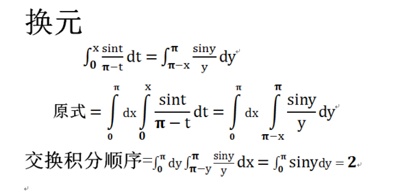
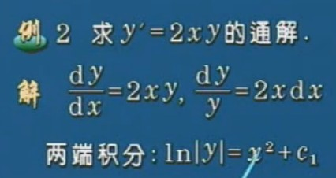
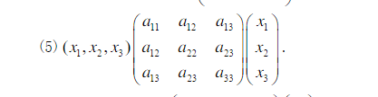

## 用python解方程

本文将介绍如何用python解决数学题。
说到数学题，相信大家都不陌生，从小学到大学都跟数学打交道。
其中初中的方程组，高中的二次曲线，大学的微积分最为头疼，今天我们将使用python
来解决方程组问题，微积分问题，矩阵化简。

本文用到的相关知识：

- python基础
- python的Sympy库


### Sympy库介绍

SymPy是符号数学的Python库。它的目标是成为一个全功能的计算机代数系统，同时保持代码简洁、易于理解和扩展。
SymPy完全是用Python写的，并不需要外部的库。

大家可能还是不太明白，我稍微解释一下，单纯用语言内置的运算与变量解决的是，由值求结果。如：

```python
#仅用于说明，不要直接运行
print x + y
```

上式中的x与y在这条语句执行前你肯定得赋值的，否则就会出错。

而符号计算不同，你可以在之前将其设为符号。

```python
#仅用于说明，不要直接运行
x = Symbol('x')
y = Symbol('y')
print x + y
```

上述代码是可以的。因为Sympy库将x与y转换成了符号（概念上）。
经过介绍，你应该稍微懂了一点，经过下面的介绍，你会更加明白。


### 解二元一次方程功能实现

解方程的功能主要是使用Sympy中solve函数实现。

示例题目是：


#### 符号表示

方程中的符号

```python
from sympy import *
x = Symbol('x')
y = Symbol('y')
```

或者

```python
from sympy import *
x, y = symbols('x y')
```

第二个用空格隔开，下面代码中用x，y。括号里面的其实可以随意定义，因为是显示用。
比如：

```python
x = Symbol('x1')
```

但考虑到易读性还是相同比较好。

#### 方程表示

代码表示与手写还是有区别的，下面列出常用的：

- 加号 +
- 减号 -
- 除号 /
- 乘号 *
- 指数 **
- 对数 log()
- e的指数次幂 exp()

对于长的表达式，如果不确定，就加小括号

题目中表达式可表示为：

```python
2 * x - y - 3 
3 * x + y - 7
```

由于需要将表达式都转化成右端为0

#### 利用solve函数解方程

在解决例子之前，我们先解决一个一元一次的方程。

```python
x * 2 - 4
```

虽然很容易口算出来，我们还是要用solve函数

```python
print solve(x * 2 - 4, x)
#result
#[2]
```

solve：第一个参数为要解的方程，要求右端等于0，第二个参数为要解的未知数。还有一些
其他的参数，想了解的可以去看官方文档。

下面进行例题求解：

```python
solve([2 * x - y - 3, 3 * x + y - 7],[x, y])
```

完整代码为：

```python
from sympy import *
x = Symbol('x')
y = Symbol('y')
print solve([2 * x - y - 3, 3 * x + y - 7],[x, y])
```
结果如下：


麻麻，我跟正确答案一样哦~


### 解微积分相关习题实现

示例题目一（求极限）：


#### 符号表示及方程表示

```python
from sympy import *
n = Symbol('n')
s = ((n+3)/(n+2))**n
```

#### 利用limit函数求极限

在解之前通过几个例子认识一下limit函数

```python
from sympy import *
x = Symbol('x')
print limit(1/x**2, x, 0)
#result
#oo
print limit(x*(sqrt(x**2 + 1) - x), x, oo)
#result
#1/2
```

介绍一下结果中出现的符号：

- oo 无穷大
- E e 
- pi 圆周率 

另外可以使用init_printing()来使我们的输出更美观,也可直接用pprint()函数

比如

```python
>>> from sympy import *
>>> x = Symbol('x')
>>> x*(sqrt(x**2 + 1) - x)
  /        ________\
  |       /  2     |
x*\-x + \/  x  + 1 /
```

完整代码：

```python
from sympy import *
n = Symbol('n')
s = ((n+3)/(n+2))**n
print limit(s, n, oo)
#result
#E
```


示例题目二（求定积分）：


#### 符号表示

```python
from sympy import *
t = Symbol('t')
x = Symbol('x')
```

#### 方程表示与使用integrate函数求解

integrate函数用于积分问题 

例子：

```python
>>> integrate(6*x**5, x)
 6
x
>>> integrate(cos(x), x)
sin(x)
```

表示 f(x) ：

```python
m = integrate(sin(t)/(pi-t),(t,0,x))
```

表示 目标积分式

```python
n = integrate(s,(x,0,pi))
```

完整代码：

```python
from sympy import *
t = Symbol('t')
x = Symbol('x')
m = integrate(sin(t)/(pi-t),(t,0,x))
n = integrate(s,(x,0,pi))
print n
```

结果为2

答案：


### 解微分方程

例题：



#### 符号表示与等式表示

这里与之前不同的是增加了函数的表示(用f(x)表示y)，即例题中的y还有微分表示

```python
from sympy import *
f = Function('f')
x = Symbol('x')
```

下面是表示y'

```python
f(x).diff(x)
```

这里稍微介绍一下diff函数

例子：

```python
>>> diff(sin(x),x)
cos(x)
>>> diff(x**3,x)
3*x**2
```

上面都是一阶导，你会问高阶导怎么办？好办。

```python
>>> diff(x**3,x)
3*x**2
>>> diff(x**3,x,1)
3*x**2
>>> diff(x**3,x,2)
6*x
>>> diff(x**3,x,3)
6
>>> diff(x**3,x,4)
0
```

改变第三个参数即可。

下面继续我们的解题过程。

```python
#左端
f(x).diff(x)
#看一下
pprint(f(x).diff(x))

#result
#d
#--(f(x))
#dx

#右端
2*f(x)*x
```

#### 用dsolve函数解微分方程


同样，第一个参数为要解的式子，移项为右端为0。第二个参数为要解的函数

```python
dsolve(f(x).diff(x)-2*f(x)*x,f(x))
```

结果为：

```python
Eq(f(x), C1*exp(x**2))

#即f(x) = C1*exp(x**2)
```

对比答案可以发现正确。

完整代码:

```python
from sympy import *
f = Function('f')
x = Symbol('x')
print dsolve(f(x).diff(x)-2*f(x)*x,f(x))
```


### 矩阵化简

平时线性代数问题中我们会遇到化简问题，虽然不算难，但着实麻烦。而且，出一点错就会导致
结果出错。不过好运的是SymPy提供了相关的支持。

例题：



#### 符号表示与矩阵表示

```python
from sympy import *
x1,x2,x3 = symbols('x1 x2 x3')
a11,a12,a13,a22,a23,a33 = symbols('a11 a12 a13 a22 a23 a33')
m = Matrix([[x1,x2,x3]])
n = Matrix([[a11,a12,a13],[a12,a22,a23],[a13,a23,a33]])
v = Matrix([[x1],[x2],[x3]])
```

注意m的表示，需要有两个中括号

#### 化简实现

```python
print m * n * v
```

得到的是：

```python
Matrix([[x1*(a11*x1 + a12*x2 + a13*x3) + x2*(a12*x1 + a22*x2 + a23*x3) + x3*(a13*x1 + a23*x2 + a33*x3)]])
```

使用

```python
f = m * n * v
print f[0]
```

可以进一步得到化简后的式子

也许你要问我要化简后在计算怎么办？下面我就举个例子。
如果上式中x1，x2，x3均等于1，则可这样代入。

```python
from sympy import *
x1,x2,x3 = symbols('x1 x2 x3')
a11,a12,a13,a22,a23,a33 = symbols('a11 a12 a13 a22 a23 a33')
m = Matrix([[x1, x2, x3]])
n = Matrix([[a11, a12, a13], [a12, a22, a23], [a13, a23, a33]])
v = Matrix([[x1], [x2], [x3]])
f = m * n * v
print f[0].subs({x1:1, x2:1, x3:1})
```

可得

```python
a11 + 2*a12 + 2*a13 + a22 + 2*a23 + a33
```


